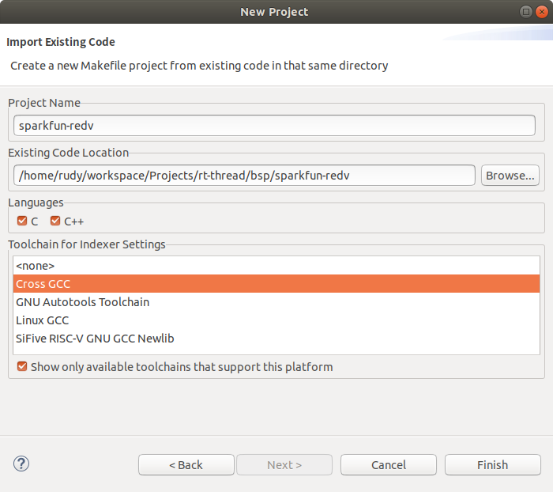
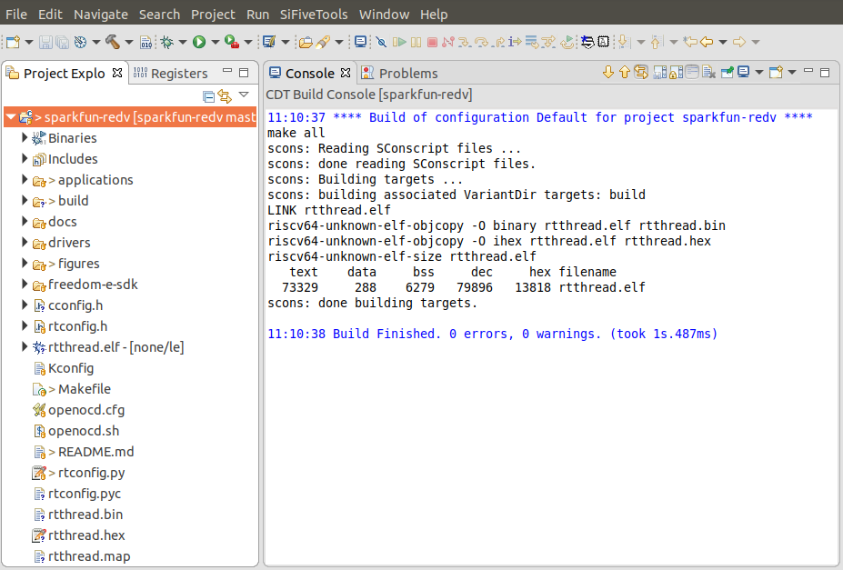
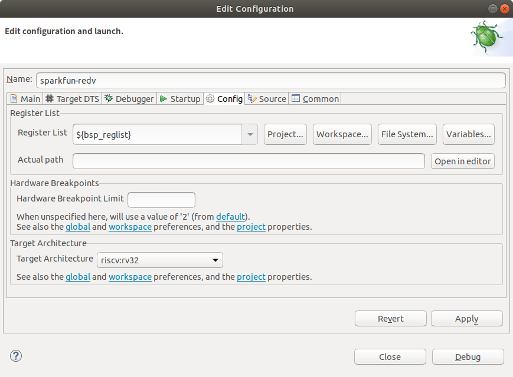
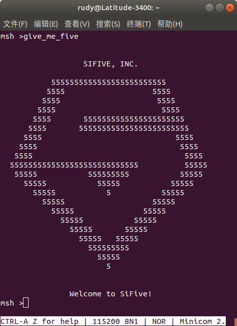

# 运行 RT-Thread 操作系统


## 准备工作

### BSP

目前 RT-Thread 官方仓库还没有提供 Sparkfun RED-V 开发板的 BSP 包，想尝试的小伙伴可以先克隆我的！

仓库地址：<https://github.com/luhuadong/rt-thread/tree/riscv/bsp/sparkfun-redv>

### 配置工具链

编译工具依然使用 Freedom Studio 集成的 riscv64-unknown-elf-gcc 编译工具链。因此，在开始之前，您还需要安装 [Freedom Studio](https://www.sifive.com/software) 集成开发环境。

特别地，如果您想在 Freedom Studio 导入并编译工程，可能需要下载 v2019.08.1 版本才行。

- [FreedomStudio-2019-08-1-lin64](https://static.dev.sifive.com/dev-tools/FreedomStudio/2019.08/FreedomStudio-2019-08-1-lin64.tar.gz)
- [FreedomStudio-2019-08-1-win64](https://static.dev.sifive.com/dev-tools/FreedomStudio/2019.08/FreedomStudio-2019-08-1-win64.zip)
- [FreedomStudio-2019-08-1-mac64](https://static.dev.sifive.com/dev-tools/FreedomStudio/2019.08/FreedomStudio-2019-08-1-mac64.tar.gz)

#### Linux

如果您和我一样使用 Linux 系统，可以直接通过命令行进行编译。只需要修改该 BSP 的 rtconfig.py 配置文件中编译工具链路径。

```python
if  CROSS_TOOL == 'gcc':
    PLATFORM    = 'gcc'
    EXEC_PATH   = r'/opt/FreedomStudio/SiFive/riscv64-unknown-elf-gcc-8.3.0-2020.04.1/bin/'
```

并确保 Makefile 中的 scons 配置正确即可。

```makefile
#scons := python ${SCONS}\scons.py
scons = scons

all:
	@$(scons)

clean:
	@$(scons) -c
```

#### Windows

假设工具链的默认位置为 `SiFive/riscv64-unknown-elf-gcc-8.3.0-2019.08.0/bin/` 目录。运行 Env 工具，根据实际情况，输入以下命令设置环境变量：

```shell
set RTT_EXEC_PATH=工具链的路径
set path=%path%;工具链的路径
```

例如：

```shell
set RTT_EXEC_PATH=C:\FreedomStudio-2019-08-1-win64\SiFive\riscv64-unknown-elf-gcc-8.3.0-2019.08.0\bin
set path=%path%;C:\FreedomStudio-2019-08-1-win64\SiFive\riscv64-unknown-elf-gcc-8.3.0-2019.08.0\bin
```

**从 Env 工具打开 IDE**

在 Env 中使用 cd 命令切换到 FreedomStudio 解压后的目录中，再执行 `FreedomStudio.exe` 文件启动 IDE。例如：

```
cd C:\FreedomStudio-2019-08-1-win64
FreedomStudio.exe
```

### 导入工程

以下步骤适用于 Windows 和 Linux 系统（MacOS 没有测试过）。

使用 FreedomStudio 导入工程，点击菜单栏左上角 `File -> Import...`，展开 `C/C++` ，选择 `Existing Code as Makefile Project` ，点击 Next 继续。


在编辑框中填入 bsp 文件所在目录，选择 `Cross GCC` ，点击 Finish 导入。



### 编译

选中要编译的工程，点击左上角的锤子图标开始编译。



当窗口输出 `Build Finished` ，左侧文件列表出现 `rtthread.elf` 文件时，即为编译成功。

另外，如果使用 Linux 命令行编译，当配置好 BSP 后，直接在 sparkfun-redv 目录执行 scons 即可完成编译。

```shell
rudy@Latitude-3400:~/workspace/Projects/rt-thread/bsp/sparkfun-redv$ scons
scons: Reading SConscript files ...
scons: done reading SConscript files.
scons: Building targets ...
scons: building associated VariantDir targets: build
CC build/applications/led/led.o
CC build/applications/main.o
CC build/drivers/board.o
CC build/drivers/drv_gpio.o
CC build/drivers/drv_usart.o
CC build/drivers/interrupt.o
...
LINK rtthread.elf
riscv64-unknown-elf-objcopy -O binary rtthread.elf rtthread.bin
riscv64-unknown-elf-objcopy -O ihex rtthread.elf rtthread.hex
riscv64-unknown-elf-size rtthread.elf
   text	   data	    bss	    dec	    hex	filename
  73113	    288	   6279	  79680	  13740	rtthread.elf
scons: done building targets.
```


## 运行 RT-Thread

如果您通过 Linux 命令行编译成功，只需要将 rtthread.hex 拖曳进 HiFive U 盘即可。如果想通过 FreedomStudio 下载、调试，请参照如下步骤。

### 配置 Debug 参数

使用 type-c usb 数据线连接电脑与开发板。右键列表中的 `rtthread.elf` 文件，选择 `Debug As->1 As JLink launch`。

点击 Debugger 选项卡，选择设备名称 `FE310` 


点击 Config 选项卡，在 'Target Architecture' 处选择 'riscv:cv32' ，点击 Debug 开始调试。



### 运行结果

下载程序之后，连接串口（115200-N-8-1），可以看到 RT-Thread 的输出信息：


可以看到板载的蓝色 LED 灯以 1Hz 频率闪烁，按下 Tab 键可以查看 RT-Thread 内置的命令。

```shell
msh >
RT-Thread shell commands:
give_me_five     - Show the SiFive logo
memcheck         - check memory data
memtrace         - dump memory trace information
clear            - clear the terminal screen
version          - show RT-Thread version information
list_thread      - list thread
list_sem         - list semaphore in system
list_event       - list event in system
list_mutex       - list mutex in system
list_mailbox     - list mail box in system
list_msgqueue    - list message queue in system
list_mempool     - list memory pool in system
list_timer       - list timer in system
list_device      - list device in system
help             - RT-Thread shell help.
ps               - List threads in the system.
free             - Show the memory usage in the system.
```

执行 `ps` 查看系统线程运行情况：

```shell
msh >ps
thread               pri  status      sp     stack size max used left tick  error
-------------------- ---  ------- ---------- ----------  ------  ---------- ---
tshell                20  running 0x00000140 0x00001000    22%   0x00000007 000
tidle0               255  ready   0x000000f0 0x00000400    23%   0x00000016 000
main                  85  ready   0x00000140 0x00000800    20%   0x00000013 -02
```

执行 `list_device` 查看系统设备：

```shell
msh >list_device
device                                   type         ref count
-------------------------------- -------------------- ----------
dusart                           Character Device     2
```

另外，该 BSP 还内置了一个 `give_me_five` 命令：



好啦！关于 RT-Thread 和 RISC-V 的更多内容，我们后面再一起探索。今天就先到这里啦～